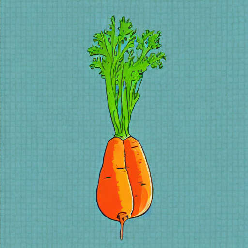

# AI-Powered Game Asset Generation Pipeline

## Problem Understanding

In modern game development, creating a large and diverse set of assets that all conform to a single, unique art style is a significant challenge. Manually creating each asset is time-consuming, expensive, and can lead to stylistic inconsistencies.

The goal of this project is to address this challenge by creating a tool that can **learn a specific art style from a collection of existing images** and then **generate entirely new assets** (e.g., vegetables, furniture, props) that perfectly match that learned style. This automates a significant portion of the asset creation pipeline, enabling rapid prototyping and development while ensuring artistic cohesion.

## 1. Solution Design & Methodology

### Core Technology
The solution is built on top of **Stable Diffusion**, a powerful, open-source text-to-image model. To teach it a new art style without the prohibitive cost of training the entire model from scratch, we employ a highly efficient fine-tuning technique called **LoRA (Low-Rank Adaptation)**.

### Why LoRA?
-   **Efficiency**: LoRA works by inserting small, trainable "adapter" layers into the existing model. This means we only need to train a tiny fraction of the total parameters, making the training process significantly faster and less resource-intensive.
-   **Portability**: The output of the LoRA training process is a small file (typically a few megabytes), making it easy to store, share, and apply to the base Stable Diffusion model.
-   **Flexibility**: This approach allows for a modular system where different style "adapters" can be mixed and matched as needed.

### Project Workflow
The project is split into two main components that work in tandem:

1.  **`lora_train.py` (The "Teacher")**:
    -   This script takes a directory of images that define the target art style.
    -   It uses LoRA to fine-tune the Stable Diffusion model on these images.
    -   During this process, it learns to associate a special, unique text token (`<GameStyle>` by default) with the visual characteristics of the art style.
    -   The output is a set of LoRA weights (`.safetensors` file) that encapsulates the learned style.

2.  **`inference.py` (The "Artist")**:
    -   This script provides an interactive command-line interface for generating new assets.
    -   It loads the base Stable Diffusion model and dynamically applies the trained LoRA weights.
    -   Users can input a text prompt (e.g., "a plastic pen") and include a special placeholder (`{style_token}`), which the script replaces with the learned style token.
    -   The model then generates an image of the described object, rendered in the custom art style.


## 2. Usage Instructions

#### Step 1: Clone the repository and setup the environment

```bash 
# Clone the repository:
git clone https://github.com/mertgokbayrak/apps-interview-project.git

# Create and activate a Python virtual environment
python3 -m venv .venv
source .venv/bin/activate

# Install all required dependencies
pip install --upgrade pip
pip install -r requirements.txt
```
#### Step 2: Prepare Assets and Configuration
Place all your training images inside the `assets/` folder.


#### Step 3: Train the LoRA Model
Run the training script using `accelerate`. This will read the training images and create the LoRA model based on the `TRAIN_*` parameters in your `.env` file.


```bash
accelerate launch lora_train.py
```
The final LoRA adapter will be saved to the location specified by `TRAIN_OUTPUT_DIR`.

#### Step 4: Generate New Assets
Once training is complete, run the inference script to start the interactive generation session.

```bash
python inference.py
```
The script will load your trained LoRA and prompt you to enter text. To generate an asset in your new style, use the `{style_token}` placeholder in your prompt.

-   **Example Prompt:** `a cartoon tomato, in the style of {style_token}`
-   **To Exit:** Type `quit`.

## 3. Showcase of Generated Examples

The following examples demonstrate the model's ability to capture the distinct style of the training assets (vibrant, 2D, cartoonish with clean outlines) and apply it to new, unseen concepts.

| Training Asset Style (Sample) | Generated Asset (New Concept) |
| :-----------------------------: | :--------------------------------: |
|  |  |
| *Original art style* | *Generated "a single carrot" in the learned style* |

*(Note: The images above are placeholders. After running the scripts, you can replace the paths to display your actual results.)*

## 4. Docker Usage

For a more reproducible and isolated environment, you can use the provided `Dockerfile`.

#### Step 1: Build the Docker Image
From the root of the project, run:
```bash
docker build -t <Your-Docker-Image-Name> .
```

#### Step 2: Run the Container

**To Run Training:**
This command mounts the output directory and passes in your GPU(s) for training.
```bash
# For NVIDIA GPUs
docker run --rm -it --gpus all \
  -v ./lora_output:/app/lora_output \
  asset-generator \
  accelerate launch lora_train.py

# For Mac / CPU-only
docker run --rm -it \
  -v ./lora_output:/app/lora_output \
  asset-generator \
  accelerate launch lora_train.py
```

**To Run Inference:**
This command starts the interactive inference script.
```bash
docker run --rm -it \
  -v ./generated_images:/app/generated_images \
  -v ./lora_output:/app/lora_output \
  asset-generator
```

## 5. Self-Critique & Future Improvements

### Challenges & Solutions
-   **Dependency Conflicts**: The initial development faced significant `ImportError` issues due to version incompatibilities between the `diffusers`, `transformers`, and `accelerate` libraries. This was resolved by meticulously finding compatible versions and pinning them in `requirements.txt`.
-   **LoRA Weight Loading**: The `diffusers` library had issues directly loading the saved `.safetensors` file via high-level functions. This was overcome by manually loading the weights and applying them to the U-Net's attention processors, a more robust and direct method.

### Future Improvement Ideas
-   **Web Interface**: Replace the command-line inference script with a user-friendly web UI using Gradio or Streamlit. This would allow for easier interaction, with sliders for parameters like steps and guidance scale.
-   **Batch Generation**: Enhance `inference.py` to accept a list of prompts from a text file, allowing for the batch generation of hundreds of assets overnight.
-   **Negative Prompts**: Add a `--negative_prompt` argument to the inference script to give users more control over the output by specifying what to *avoid* (e.g., "blurry, watermark, text").
-   **Hyperparameter Tuning Dashboard**: Integrate a tool like TensorBoard or Weights & Biases more deeply to track experiments and systematically tune hyperparameters (LoRA rank, alpha, learning rate) to find the optimal settings for any given art style.

## 6. Assumptions Made

-   **Hardware**: It is assumed the user has a reasonably modern GPU (NVIDIA with CUDA or Apple M-series) for training. While the scripts will run on a CPU, the time required would be impractical.
-   **Input Data Quality**: The solution assumes that the training images provided in the `assets` folder are of good quality, reasonably high resolution, and stylistically consistent. The model's learning ability is directly tied to the quality of the input data.
-   **User Familiarity**: The usage instructions assume a basic familiarity with the command line for running Python scripts and managing files.
